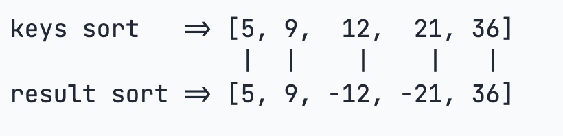
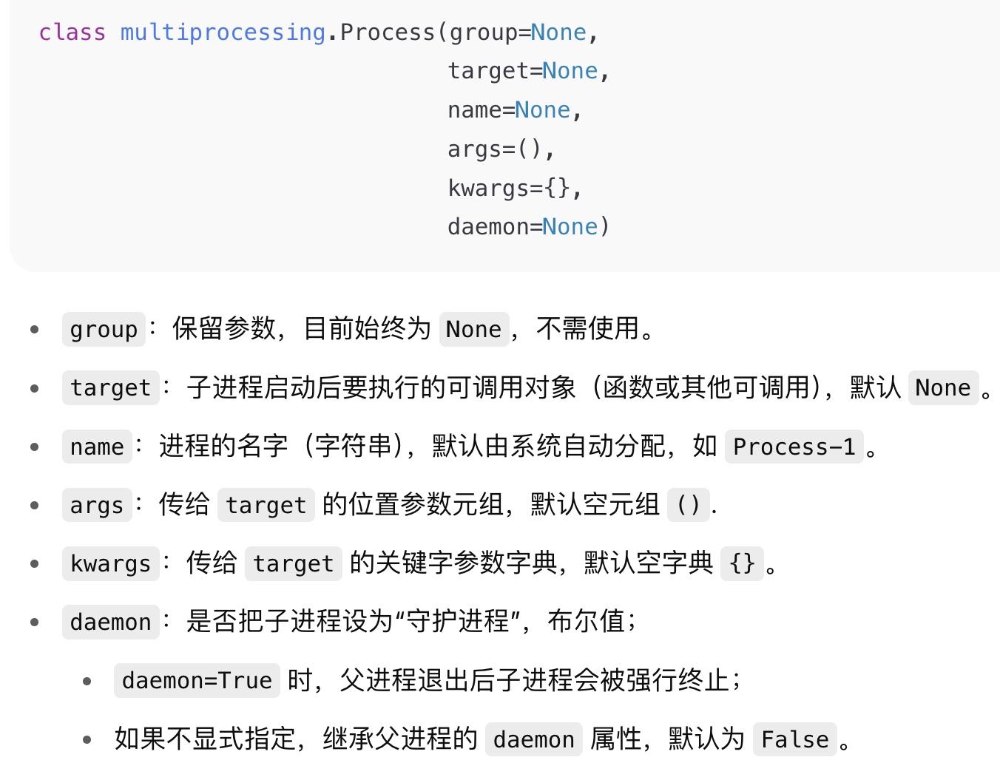

学习思路
先过一遍，再实操
再用到哪个复习哪个（如此往复）
最后学YOLOv8


# 语法
* `input()`读取键入
* 转义字符：`\`
    - `\n`换行
    - `\000`空
    - `\r`百分比进度
* 变量用`=`赋值（可以一次性赋多值）
* 变量不需要定义类型，直接赋值即可
    - `a = b = c = 1`
    - `a, b, c = 1, 2, "areyouok"`
* 变量是对象的引用

    ```
    a = [1, 2, 3]
    b = a         # b 和 a 指向同一个列表对象
    b.append(4)
    print(a)      # 输出：[1, 2, 3, 4]（因为 a 和 b 指向同一个对象）
    ```
* `import`导入相应模块
* `from A import B`从模块A中导入函数B
* `_`：名字前面加一个下划线 `_` 有**特殊含义**：它表示这个属性或方法是“**内部使用的（private-like）**”。
## 切片`[:]`（前闭后开）
* 从序列（列表、字符串、元组）中提取子序列；支持反向索引、步长操作
`sequence[start:stop:step]`
* 
## `if __name__=='__main__':`
* `"__name__"`是一个特殊变量，`"__main__"`是一个字符串，`"__name__"`单独运行时被python赋值为`"__main__"`，别的程序调用时，它被赋值为它所在程序的名称，它所在程序被当作一个模块被调用
* **底层逻辑：** python 程序运行时，从代码的上到下逐行执行的，函数/类定义 本身不回被执行，只有被调用时才会执行。所以这行代码是一个普通的if语句，用它来防止意外调用（**入口保护**）
## 正则表达式

* [常用符号截图01](assets/Regular_Expression_Symbols01.png)
* [常用符号截图02](assets/Regular_Expression_Symbols02.png)
* [示例代码](code/Regular_expression.py)

* `re`模块使 Python 语言拥有全部的正则表达式功能。`import re`
* `re.sub(pattern, repl, string, count=0, flags=0`：用`repl`替换`string` 
  * `pattern`：正则表达式模式，用于匹配字符串中的内容
  * **`count`**（可选）：最多替换的次数（默认 0 表示全部替换）
  * **`flags`**（可选）：正则表达式标志（如 `re.IGNORECASE` 忽略大小写）
  * [官方文档](https://docs.python.org/zh-cn/3/library/re.html#re.sub)

## 语句

* del
  用于删除对象的引用或名称绑定
   - `del x`删除变量`x`
   - `del lst[2]`删除列表中索引为2的元素
   - `del person["age"]`删除字典`person`中键`"age"`及其对应的值
-------
1. 
2. `type()`
    - 查看变量的类型
    - 以字符串形式输出，输出的类型用单引号`''`引着
    - 示例`print(type(x))` -> `<class 'int'>`
    * `type()`：认为子类**不是**一种父类类型
3. `isinstance()`
    - 用于检查一个对象是否为某个特定类或类型的实例
    - 示例：检查`a`是否为`int`的实例。
    ```
    a = 111
    isinstance(a, int)
    
    ->True #a是int型
    ```
    * `isinstance()`：认为子类**是**一种父类类型

1. append()


# 方法

* 特殊方法（魔法方法）：前后有两个下划线的方法。控制对象怎么回应python的内置行为,例如：`__iter__`


# 关键字

1. `del`
    * 用于删除对象的引用或名称绑定
2. `raise`
    * 手动触发异常
3. `yield`
    - 用于创建生成器，定义生成器函数
# Python基础
## 数据类型

### 1.数字
* int（长整型）、float、bool、complex（复数）
    - `bool`是`int`的子类
    - `true`,`false`可以和数字相加
    ```
    True + 1    ->2
    False + 1   ->1
    ```
* 数学运算符
    - 乘方：`a ** b`
    - 除法：`/`浮点数`//`整数(取整数部分)
    - 其余跟java一致
    - 混合计算时，整型会转成浮点型

### 2.String（字符串）
* #### 用`''`或`""`括起来

* [用法示例](code/base/string.py)

* 函数
    - `ord()`：获取字符整数表示
    - `chr()`：把编码转换为对应的字符
    - `encode()`：把Unicode表示的`str`->`bytes`
        - 中文的ascii超范围会报错
    - `decode()`：把`bytes`->`str`
    - `len()`：计算`str`包含的字符数
    
    ###### 字符串格式化  
    
    ``````python
    for idx, ent in enumerate(entries, start=1):
    	f"{idx:02d}_{ent['safe']}"
    ``````
    
    * `f`表示这是一个“格式化字符串”，它允许你在字符串内部用花括号 `{}` 嵌入 Python 表达式，并在运行时把它们的值插入进去
        * `idx`：从当前条目的编号开始（对应`start`的1）
        * `ent`：字典，它的键`'safe'`存着对处理过的表格标题
        * `0`：用0做填充字符，`2`：输出宽度为2，`d`：十进制整数
    
    * 用`%`实现，按顺序一一对应：
        - `%s`字符串、`%d`整数、`%f`浮点数、`%x`十六进制数
    * 格式化整数和浮点数还可以指定是否补0和整数与小数的位数
    
* 其他
    * `+`连接运算符，`*`重复操作（要乘的次数）
    * 索引：`0`从头起始，`-1`从末尾开始（前闭后开）
    * 截取字符串（前闭后开）
        - `str[头下标:尾下标]`
    * 字符串运算符
       - `+`拼接字符串
       - `*`重复输出
       - `in`字符串中包含给定的字符，返回True
    * python对`bytes`类型的数据用带`b`的前缀的单引号或双引号表示：`x = b'ABC'`
        - `ABC`是str类型，一个字符对应若干字节；`b'ABC'`是bytes类型，一个字符只占一个字节

**字符串方法**
* `format()`：【格式化字符串】
    - 用传入的参数一次替换字符串哪的占位符`{0}`、`{1}`、......
* `f-string`：【格式化字符串】
    - 用以开头`f`的字符串，字符串包含`{xxx}`，就会以对应的变量替换
* `join()` 
    - 语法：`分隔符.join(可迭代对象)`
    - 作用：将多个字符串连成一个新字符串
    - `'-'.join(['a','b','c'])`->`'a-b-c'`
* `strip()`
    - `txt = t.strip()`移除字符串两端的空白字符（空格、换行符、制表符等）
    - 例：`"   hello    ".strip()`->`hello`
* `startswith()`前缀匹配
    - 检查字符串是否以指定的前缀开头,boolean返回值
    - 语法：`str.startswith(前缀,索引头,索引尾)`索引头、尾可省略
    - 多前缀检查：`text.startswith(("http", "https"))`
* `endswith`后缀匹配
    - 检查字符串是否以指定的后缀开头,boolean返回值
    - 语法：`str.endswith(前缀,索引头,索引尾)`索引头、尾可省略
    - 多后缀检查：
        ```
        # 检查是否以 ".txt" 或 ".pdf" 结尾
        print(filename.endswith((".txt", ".pdf")))  # 输出：True
        ```
* `split('：')`
    - 按中文字符分隔（用全角符号）


-------
### 3. list（列表）
* [用法示例](code/base/list_and_tuple.py)

* #### 写在`[]`之间，元素用`,`隔开

* 有序对象的集合；随时添加删除其中的元素

* 列表中元素类型可以不同；列表之间可以嵌套

* 直接给对应索引赋值：把某个元素替换成别的元素

###### 方法：

添加元素：

* `lst.append(x)`：在**列表末尾插入一个对象`x`**，无论`x`是什么类型，都被带当作单个元素加入

* `lst.extend(iter)`：在**列表末尾一次性添加一个可迭代对象的所有元素**，相当于多次`append`
* `insert(索引,'元素')`在指定位置插入元素（只能一条语句加一个元素）
* `pop()`删除末尾元素；`pop(i)`删除指定位置的元素
* `len()`求元素个数

### 4.dict（字典）
* [用法示例](code/base/dict.py)
* #### 用`{key:value}`括起来
* `key`是**不可变对象**
* 无序的对象（键`key`:值`value`）集合
* 元素通过键`key`存取，`key`是唯一的
* `key`不存在就会报错
    - 用`in`判断
        ```
        >>> 'Thomas' in d
        False
        ```
    - 用`get()`，不存在返回None或自己指定的value
        ```
        >>> d.get('Thomas')
        >>> d.get('Thomas', -1)
        -1
        ```
        - 注：返回None的时候Python的交互环境不显示结果。

### 5.tuple（元组）
* [用法示例](code/base/list_and_tuple.py)
* #### 写在`()`中，元素之间用`,`隔开
* 一旦初始化便不可修改
* 元素类型可以不同
* “可变”元组：实际上可变的是其内部的其他数据类型（例如：列表）
* 元组之间可以用`+`、`+=`和`*`号进行运算


### 6.set（集合）
* [用法示例](code/base/set.py)
* #### 用`{key}`括起来
* 无序、可变，用于存储**唯一**的元素
* 集合中元素不重复，可以进行交（`&`）、并（`｜`）、差（`-`）集等操作
* 创建空集合必须用`set()`
* 方法：
    - `set()`创建集合
    - `add(key)`添加元素到set中，可以重复添加，但没效果
    - `remove(key)`删除元素

## 循环
* for 循环
    ```
    for item in iterable:
        # 循环主体
    else:
        # 循环结束后执行的代码
    ```
    - 
* while 循环
    ```
    while <expr>:
        <statement(s)>
    else:
        <additional_statement(s)>
    ```
    - expr为true，执行statement(s)，为false，执行additional_statement(s)

## 条件控制
* [用法示例](code/base/condition_control.py)
* `if`
  * **三元表达式** `A if 条件 else B`：条件为true执行A，否则为B
  * 
* `match...case`
# 函数
`*`：序列——把数据打包成序列（列表）；把序列解包成一个个元素
`**`字典——打包成字典，把解包为一个个元素
1. 函数的定义：
    * `def`语句
        ```
        def my_abs(x):
        if x >= 0:
            return x
        else:
            return -x
        
        print(my_abs(-99))
        ```
2. **参数组合**（5种）：（按顺序必须是）必选参数、默认参数、可变参数`*args`、命名关键字参数、关键字参数`**kw`
1. 必选参数在前，默认函数在后
2. **默认参数必须指向不变对象！**
3. **可变参数：**参数个数不固定，可以接收`tuple`、`list`等；定义可变参数在前面加`*`
    - 定义：`def calc(*numbers):`
    - 调用（传参）：
        ```        
        >>> nums = [1, 2, 3]
        >>> calc(nums[0], nums[1], nums[2])
        14
        
        >>> nums = [1, 2, 3]
        >>> calc(*nums)
        14
        ```
1. **关键字参数**：
    ```
    def person(name, age, **kw):
        print('name:', name, 'age:', age, 'other:', kw)
    ```
   - 函数person除了必选参数name和age外，还接受关键字参数kw。在调用该函数时，可以只传入必选参数：
        ```
        >>> person('Michael', 30)
        name: Michael age: 30 other: {}
        ```
1. **命名关键字参数**：用`*`作为分隔，其后面的参数被视为命名关键字参数；可变参数后的就可以省去`*`
    - 调用（传参）：必须传入参数名
    ```
    # 定义：
    def person(name, age, *args, city, job):
        print(name, age, args, city, job)
    
    # 调用：
    person('Jack', 24, city='Beijing', job='Engineer')
    ```
-------

### **部分python内置函数**
1. `abs(参数)`：求绝对值
2. `max(参数1,参数2,...)`：求最大值
3. `int(参数)`：把参数转换成int型
4. `print()`：默认输出换行；不需要换行：末尾加上`end=""`
5. `enumweate([列表元素])`：把list变成索引-元素对
6. `enumerate(iterable, start=0)`返回一个枚举对象（元组，包含计数值和通过迭代iterable获得的值）。[Python文档](https://docs.python.org/zh-cn/3/library/functions.html#enumerate)
7. `getprevious()`返回当前元素的“前一个兄弟节点”
8. `getattr(obj,name,default)` 获取对象的属性值。[Python文档](https://docs.python.org/zh-cn/3/library/functions.html#getattr)
   * `getattr(prev, 'text', '')`：`prev` 代表前一个元素；`'text'` 是要获取的属性名，也就是元素的文本内容；`''` 是默认值，当 `prev` 对象没有 `text` 属性时，就会返回这个默认的空字符串。
9. `pd.DataFrame()`Pandas中创建表格的类（创建一个Excel表格对象）
10. `df.columns`Pandas的DataFrame的属性，查看或设置表的列名
#### **高阶函数**
1. `map(参数,Iterable)`：将传入的函数依次作用到列的每个元素，并把结果作为新的`Iterator`返回
    * `map()`传入的第一个参数是`f`（即函数对象本身）
2. `reduce(参数，序列)`：把结果继续和序列的下一个元素做累积计算（例：累加）
    * `reduce(f,[x1,x2,x3,x4])` = `f(f(f(x1,x2),x3),x4)`
3. `filter()`：把函数依次作用于每个元素，根据返回的boolean决定是否保留该元素
    * 用于过滤序列
4. `sorted(序列,key)`：对序列进行排序
    - `key=abs`按绝对值大小排序
    - 排序的关键在于实现一个映射函数
    `sorted([36, 5, -12, 9, -21], key=abs)`
    

5. ###### `map()`用于对可迭代对象（如列表、元组）中的每个元素执行相同的操作，并返回一个迭代器

   * `map(函数，可迭代对象)`
   * `lng,lat = map(float, geocode_info['location'].split(','))`
   * **执行步骤**：
     1. **`geocode_info['location'].split(',')`**
        将字符串（如 `"116.404,39.915"`）按逗号分割为列表 `["116.404", "39.915"]`。
     2. **`map(float, ...)`**
        将 `float()` 函数应用到分割后的每个元素：
        - `"116.404"` → `116.404`（浮点数）
        - `"39.915"` → `39.915`（浮点数）
     3. **`lng, lat = ...`**
        将结果解包到变量 `lng`（经度）和 `lat`（纬度）。

   


### 返回函数

[具体示例](code/function/returning_fuction.py)
* 把函数作为结果返回
* **闭包**：`lazy_sum`中又定义了函数`sum`，并且内部函数`sum`可以引用外部函数`lazy_sum`的参数和局部变量。当`lazy_sum`返回函数`sum`时，相关参数和变量都保存在返回的函数中
    * 每次调用都会返回新函数，即使传入相同参数
    * `nonlocal`：用`nonlocal`来声明变量`x`是外部函数的局部变量
        ```
        def inc():
        x = 0
        def fn():
            # nonlocal x
            x = x + 1
            return x
        return fn
        
        f = inc()
        print(f()) # 1
        print(f()) # 2
        ```
### 匿名函数
`lambda x: x * x`就是：
```
def f(s): 
    return x * x
```
* 匿名函数只能有一个表达式，不用写`return`

### 装饰器
* 在代码运行期间动态增加功能的方式，称为“装饰器”（decorator）
* 返回函数的额高阶函数，
* 函数对象有一个`__name__`属性，可以拿到函数的名字

### 偏函数

# 高级特性
## 切片
* 索引：`0`从头起始，`-1`从末尾开始
## 迭代（Iteration）
* 通过`for...in`循环遍历可迭代对象（例如：`list`、`tuple`）
* `dict`迭代
    - 默认迭代`key`
    - 迭代`value`：`for value in d.values()`
    - 同时迭代`key`和`value`：`for k,v in d.items()`

* 判断是否为可迭代对象：通过`collections.abc`模块的`Iterable`类型判断
    ```
    >>>from collections.abc import Iterable
    >>>isinstance('abc',Iterable)
    True
    ```
* 

    
## 列表生成式
* 生成list`[1,2,3,4,5,6,7,8,9,10]`可以用`list(range(1,11))`
* 列表生成式：把药生成的元素写在前面，后跟`for`循环
    ```
    >>> [x * x for x in range(1, 11)]
    [1, 4, 9, 16, 25, 36, 49, 64, 81, 100]
    ```
* `if...else`   
    * `if`写在`for`后，只单个用`if`
        - `for`后是一个筛选条件，有了`else`就是两个筛选了，所以不行
    * `if`写在`for`前，必须加`else`
         - `for`前是一个表达式，要计算出结果，所以对所有情况都要有结果

## 生成器（generator）
* 把列表生成式的`[]`改成`()`
    * 通过`next()`获得generator的下一个返回值
    * 用for循环迭代`generator`

* 使用了`yield`的函数被称为生成器函数；它可以在迭代的过程中逐步产生值，而不是一次性返回所有结果
* 生成器函数中使用`yield`语句时，函数的执行将会暂停，并将`yield`后面的表达式作为当前迭代的值返回
* 调用一个生成器函数，返回一个迭代器对象


## 迭代器(Iterator)
* 可直接用于`for`循环的数据类型：（集合数据类型）`list`、`tuple`、`dict`、`set`、`str`；`generator`（生成器和带`yield`的generator fiction）
* 可以直接作用于`for`循环的对象统称为可迭代对象`Iterable`
* 集合数据类型是`Iterable`,但不是`Iterator`，不过可以通过`iter()`函数获得一个Iterator对象。


* 访问集合元素的一种方式
* 可以记住遍历位置的对象
* 迭代器对象从集合的第一个元素开始访问，直到所有元素被访问完结束
* 迭代器只能向前不能后退
* 两个基本方法：`__iter__()`、`__next__()`
* 
* 可迭代对象：Iterable

#### 迭代器  

1. `__iter__()`
    - 在对象初始化时执行
    - 返回迭代器本身，即`iter(self)`
2. `__next__()`
    - 返回下一个迭代器对象


# 面向对象
## 类
### 类定义
* 语法格式：
    ```
    class ClassName:
        <statement_1>
        .
        .
        .
        <statrmrnt_n>
    ```
* 类实例化后可以使用其属性；创建一个类后，可以通过类名访问其属性
### 类对象

## 多继承
* 一个类继承多个父类
    ```
    class Dog(Mammal,Runnable):
        pass
    ```
* MixIn（混入）：MixIn的目的是给一个类增加多个功能


## 访问限制
* 内部属性不被外部访问：`__`在属性的名称前加上两个下划线，变成**private私有变量**
* 外部代码获取内部属性：给class类加`get_name`等方法
    ```
    def get_name(self)
        return self.__name
    ```
    
## 获取对象信息
* `type(对象)`：判断对象类型
* `isinstance(对象,类型)`：一个对象是否是该类型本身，或谓语该类型的父继承链上
* `dir(对象)`：获取一个对象的所有属性和方法。它返回一个包含字符串的list

## 实例属性&类属性
通过实例变量给实例绑属性，或者通过`self`变量
## `__slots__`
`__slots__ = ('name','age')`用tuple定义允许绑定的属性名称
## `@property`
* 负责把一个方法变成属调用


## 枚举类
* `enum`

## 元类


## StopIteration异常
* 用于标识迭代的完成，防止出现无限循环的情况


# 异常（错误、调试、测试）
## 错误
[示例](code/Error_debug_test/error.py)
### try
    ```
    try:
        # “尝试”执行这一段代码
    except ExceptionType1 as alias1:
        # 如果 try 中抛出了 ExceptionType1，就执行这里
    except (TypeA, TypeB) as alias2:
        # 可以一次捕获多个异常类型
    except ExceptionType3:
        # 也可以不写 “as” 绑定变量，若不需要使用异常对象本身
    else:
        # 如果 try 没有抛出任何异常，就会进入这里
    finally:
        # 无论是否抛出、是否被捕获，最后都会执行这里
    ```
* `as`把捕获到的异常实例赋给后面的变量
* Python的错误其实也是class，所有的错误类型都继承自`BaseException`，所以在使用`except`时需要注意的是，它不但捕获该类型的错误，还把其子类也“一网打尽”。比如：
    ```
    try:
    foo()
    except ValueError as e:
        print('ValueError')
    except UnicodeError as e:
        print('UnicodeError')
    ```
    - 第二个`except`永远也捕获不到`UnicodeError`，因为`UnicodeError`是`ValueError`的子类，如果有，也被第一个`except`给捕获了。

### 调用栈
* 如果错误没有被捕获，它就会一直往上抛，最后被Python解释器捕获，打印一个错误信息，然后程序退出。

## 调试
[示例](code/Error_debug_test/debug.py)

1. **断言（assert）**
    * 凡事用`print()`来辅助的地方，都可以用断言来替代
    * `assert`的意思是，表达式`n != 0`应该是`True`，否则按程序运行逻辑后面代码肯定会出错
    * 若断言失败，assert本身就会抛出`AssertionError`：`AssertionError: n is zero!`
    * 启动Python解释器时可以用`-O`参数来关闭`assert`，关闭后所有的`assert`语句当成`pass`看（大写字母O）
1. **logging**
    `logging.info('n = %d' % n)`
    * logging不会抛出错误，而且可以输出到文件
    * 日志等级：
        - `DEBUG`（10）:详细信息，通常只在诊断问题时使用
        - `INFO`（20）：常规运行信息（程序启动、配置完成）
        - `WARNING`（30）：表示有潜在问题（使用了将被废弃的API）
        - `ERROR`（40）：运行时错误，但程序还能继续
        - `CRITICAL`（50）：严重错误，程序通常不能继续
2. **pdb**

* 程序以单步方式运行，可以随时查看运行状态

# IO编程
## 文件读写
* `read()`一次读取文件的全部内容，文件太大可能会爆内存
* `read(size)`每次最多读取size个字节的内容
* `readline()`每次读取一行内容
* `readlines()`每次读取所有内容并按行返回`list`
[`read（）`示例](code/Error_debug_test/read.py)
### 读文件
* 标识符：
    - `‘r’`读取文本文件
    - `’rb‘`读取二进制文件（图片视频等）
* 步骤：
    1. 以读文件模式打开一个文件对象，使用Python内置的`open()`函数，传入文件名和标示符`f = open('/Users/michael/test.txt', 'r')`
    2. 文件不存在，就会抛出`IOError`的错误
    3. 调用`read()`方法`f.read()`，可以一次读取文件的全部内容，Python把内容读到内存，用一个str对象表示：`Hello,world!`
    4. 最后一步是调用`close()`方法关闭文件：`f.close()`
* 文件读写有可能产生`IOError`，后面的`f.close()`就不会调用。我们用`try ... finally`来保证无论是否出错都能正确地关闭文件
    ```
    try:
        f = open('/path/to/file', 'r')
        print(f.read())
    finally:
        if f:
            f.close()
    ```
* `with`语句，自动调用`close()`方法，跟前面`try ... finally`是一样的，且不必调用`f.close()`
    ```
    with open('/path/to/file', 'r') as f:
        printf(f.read())
    ```
* `encoding='编码类型'`：读取非UTF-8编码的文件，给open()函数传入`encoding`参数（例如`encoding='gbk'`）
* 不规范的文件可能遇到`UnicodeDecodeError`，`open()`函数后接收一个`error`参数，表示遇到编码错误后如何处置`f = open('/Uses/michael/gbk.txt', 'r',encoding='gbk', errors='ignore')`

### 写文件
* `write()`
* 标示符：
    - `w`写文本文件。若文件已存在，会直接覆盖
    - `wb`写二进制文件
    - `a`追加（append）模式写入。追加到文件末尾
* 调用`write()`后，务必要`f.close()`
* 写文件时，OS不回立即把数据写入磁盘，而是放在内存缓存起来，空闲时再慢慢写入；调用`close()`时才会立即把没写入的写进磁盘

## StringIO和BytesIO
[具体示例](code/Error_debug_test/StringBytes_IO.py)
### StirngIO
* 在内存中读写`str`
* 要把`str`写入`SringIO`，要创建一个`SringIO`，然后想文件一样写入即可
* `getvalue()`用于获得写入后的`str`
### BytesIO
* 内存中读写`bytes`
## 操作文件和目录
[示例](code/Error_debug_test/file_menu.py)
* `os.name`：`posix`说明系统是Linux、Unix或macOS，如果是`nt`，就是Windows系统
* `os.uname()`：获取系统详细
1. 环境变量
    * 操作系统中定义的环境变量，全部保存在`os.environ`这个变量中
    * `os.environ.get('key')`获取某个环境变量(`key`)的值
2. 操作文件和目录
## 序列化


# 进程和线程
* `join()`：让<u>主进程</u>（线程）等待<u>子进程</u>（线程）结束后再继续执行
## 多进程
### `fork()`系统调用
* 普通函数调用一次，返回两次。因为操作系统把当前进程（称为父进程）复制了一份（称为子进程），然后，分别在父进程和子进程内返回
* 子进程永远返回`0`，父进程返回子进程的ID。一个父进程可以`fork`出很多子进程，父进程只需要记下每个子进程的ID，子进程只需要调用`getpid()`就可以拿到父进程的ID
* Python的`os`模块封装了常见的系统调用，其中就包括`fork`
* 有了`fork`调用，一个进程在接到新任务时就可以复制出一个子进程来处理新任务（常见的Apache服务器就是由父进程监听端口，每当有新的http请求时，就fork出子进程来处理新的http请求）
* Windows没有`fork`

### multiprocessing
* `multiprocessing`模块提供了一个`Process`类来代表一个进程对象
* [启动子进程并等待其结束](code/Processes_Threads/MultiProcessing.py)
* `process()`
    

### Pool
* 若要启动大量的子进程，可以用进程池的方式批量创建子进程
* [Pool线程池](code/Processes_Threads/Pool.py)
* `Pool.appil_async`参数详解：
    ```python
    result = Pool.apply_async(
        func,         # 要在子进程中执行的可调用对象
        args=(),      # 传给 func 的位置参数 tuple
        kwds={},      # 传给 func 的关键字参数 dict
        callback=None,        #（选）func 执行成功后，将其返回值传给 callback(result)
        error_callback=None   #（选）func 抛异常后，将异常对象传给 error_callback(exc)
    )
    ```
### 子进程
* `subprocess`模块：非常方便启动一个子进程，然后控制其输入和输出
* [在Python代码中运行命令`nslookup www.python.org`](code/Processes_Threads/subprocess.py)
* `subprocess.call()`：`subprocess`模块里的一个**便利函数**
    - 在操作系统层面创建一个新进程，执行你传入的命令，父进程阻塞等待，直到子进程结束；返回子进程的退出状态码（通常 0 表示成功，非 0 表示出错）

    ```python
    subprocess.call(args,   #要执行的命令及参数列表。可以是字符串或序列：
                    *,
                    stdin=None,     #重定向子进程的标准输入，可以是 subprocess.PIPE、文件对象或 None（沿用父进程的输入）。
                    stdout=None,    #重定向子进程的标准输出，常用 subprocess.PIPE 捕获输出，或指定文件写入；默认 None（打印到屏幕）
                    stderr=None,    #重定向子进程的标准错误，行为同 stdout；默认 None。                            
                    shell=False,    #是否通过 shell（如 /bin/sh 或 Windows CMD）来解析命令；True 可执行管道、通配符等 shell 功能
                    timeout=None    #最长等待时间（秒），超时会抛出 subprocess.TimeoutExpired 异常
                    )  
    ```

### 进程间通信

## 多线程


## ThreadLocal
## 进程


# 爬虫
基本流程：
- **发送HTTP请求**：通过HTTP请求从目标网站获取HTML页面，常用`requests`库
- **解析HTML内容**：常用库BeautifulSoup、lxml、Scrapy等
- **提取数据**：定位HTML元素（标签、属性、类名）来提取所需数据
- **存储数据**：将提取数据存储到数据库、CSV文件、JSON文件等
## 解析器
把HTML字符串翻译成树状结构，才能查找标签、提取内容
* 常用解析器：`lxml`
    - 容错好，速度快
* `html.parser`：python内置，容错差
## BeautifulSoup
* 适用于解析HTML和XML文件，并提供了一些方法来导航、搜索和修改解析树
* 能通过提供简单API来提取和操作网页中的内容
1. 基本用法
    * 查找标签、获取标签属性、提取文本
    * 使用bts需要先导入bts，并将HTML页面加载到BeautifulSoup对象中
    * 通常，先用爬虫库获取网页内容
2. [获取网页标题](code/Spider/get_web_title.py)
3. [查找标签](code/Spider/find_tags.py)
    * `find()`
        - 返回第一个匹配的标签
    * `find_all()`
        - 返回所有匹配的标签
4. [获取标签的文本](code/Spider/get_tag_text.py)
    `get_text()`提取标签中的文本内容
5. [查找子标签和父标签](code/Spider/find_tags_parent_son.py)
    - 通过parent和children属性访问标签的父标签&子标签
    ```python
    #获取当前标签的父标签
    parent_tag = first_link.parent
    #获取当前标签的所有子标签
    children = first_link.children
    ```
6. [查找具有特定属性的标签](code/Spider/find_specific_attributes_tags.py)
    - 通过传递属性来查找具有特定属性的标签
        ```
        # 查找所有 class="example-class"的<div>标签
        divs_with_class = soup.find_all('div',class_='example-class') 
        # 查找具有 id="unique-id" 的<p> 标签
        unique_paragraph = soup.find('p',id='unique-id')
        ```
### CSS选择器
1. 基础选择器：
   **元素选择器**
    - `p`、`div`、`tablel`：选择所有`<p>`、`<div>`、`<table>`元素
    **类选择器**
    - `.header`：选择`class="header"`的元素
    **属性选择器**
    - `[href]`：选择带有href属性的元素
    **通用选择器**
    - `*`：选择所有元素
    2. 组合选择器：
    **后代选择器（空格）**
    - `div p`：选择div内部所有p元素（不限层级）
    - `table td`：选择table内部所有td元素
    **通用兄弟选择器 (~)**
    - `h2 ~ p`：选择h2后面的所有同级p元素 
    3. 在Scrapy中特殊用法：
   
1. `select()`
    - 允许使用类似jQuery的选择器语法来查找标签
    ```
    # 使用CSS选择器查找所有class为 'example' 的<div>标签
    example_divs = soup.select('div.example')
    
    # 查找所有 <a> 标签中的 href 属性
    links = soup.select('a[href]')
    ```

## Scrapy框架
* 专门用于抓去网页数据并提取信息。常被用于数据挖掘、信息处理、存储历史数据等应用
* 全功能的爬虫框架，高度的可扩展性、灵活性，使用复杂和大规模的网页抓取任务
* [Scrapy架构图](assets/Scrapy架构图.png)
* Scrapy 的工作基于以下几个核心组件：
    - **Spider**：爬虫类，用于定义如何从网页中提取数据以及如何跟踪网页的链接。
    - **`Item`类：**用来定义和存储要抓取的数据段。相当于数据模型。（继承自`scrapy.Item`）
    - **Pipeline**：用于处理抓取到的数据，常用于清洗、存储数据等操作。
    - **Middleware**：用来处理请求和响应，可以用于设置代理、处理 cookies、用户代理等。
    - **Settings**：用来配置 Scrapy 项目的各项设置，如请求延迟、并发请求数等。
* Scrapy项目结构：

#### Scrapy方法 
* 结构
    ```plaintext
    GPT_spider_code/                 ← 项目根目录，包含 scrapy.cfg
    ├── scrapy.cfg                   ← 指定 settings 模块路径
    ├── GPT_spider_code/            ← 项目包（包名和根文件夹同名）
    │   ├── __init__.py
    │   ├── settings.py             ← Scrapy 设置
    │   ├── items.py                ← 定义数据结构
    │   ├── pipelines.py            ← 管道处理
    │   ├── middlewares.py          ← 中间件（可选）
    │   └── spiders/                ← 爬虫目录
    │       ├── __init__.py
    │       └── weifang_spider.py   ← 你的主爬虫文件
    
    ```

* Scrapy 要求项目根目录（含`scrapy.cfg`）下必须有一个 **与项目名同名的 Python 包**（即一个包含`__init__.py`的目录），用于组织`settings.py`、`items.py`等核心文件。

##### `re_first()`正则提取方法

* 语法：`selector.re_first(正则表达式)`
* 示例：
    ```python
    code = response.xpath("//td[contain(,.'区划代码')]/text()").re_first(r'(\d{6})')
    ```
    - `r'(\d{6})'`：
        - `r''`原始字符串，避免转义
        - `\d`匹配数字（0～9）
        - `{6}`匹配6次
        - `()`捕获分组，值返回括号内的内容
##### `yield`

### `response`

* **`response.xpath()`** 是一个核心方法，用于从 HTTP 响应中提取数据。这里的 **`response`** 是一个特殊对象，代表爬虫获取到的网页内容
* **`response.text`**：网页的 HTML 文本（字符串类型）。
* **`response.body`**：网页的原始二进制内容。
* **`response.status`**：HTTP 状态码（如 200、404）。
* **`response.url`**：请求的 URL。
* **`response.headers`**：响应头信息。

- `response.url`当前这个网页的URL
- `response.xpath()`用XPath抓页面里面的元素（Scrapy推荐）
- `response.css()`用CSS选择器选元素
- **`response.follow()`**用于**跟进链接、创建新请求**的核心方法（在网页中发现新的链接需要继续爬取时使用）

  - ``````python
    response.follow(url, callback=None, meta=None)	#常用参数
    ``````

  - `url`：目标 URL（可以是相对路径或绝对路径）。

  - `callback`：回调函数（处理新响应的函数名，默认为 `None`）。

  - `meta`：传递额外数据到回调函数。

### `XPath`
#### 基础概念

* 查询语言，用于定位和提取文档中的特定元素。
* XPath 将 XML/HTML 文档视为节点树，主要节点类型有：
  - 元素节点：HTML标签，`<div>`,`<table>`
  - 属性节点：标签内的属性，`href="page.html"`
  - 文本节点：标签内的文本内容，`潍坊市`
  - 文档节点：整个文档，整个HTML文档

#### 核心语法
1. 路径表达式
    * `nodename`选择所有该名称节点
    
    * `/`从根结点开始选择（绝对路径） `/html/body/div`
    
    * `//`选择任意层级节点（相对路径）
    
    * `.`当前节点
    
    * `..`父节点
    
    * `@`选择属性
    
    * 具体实例
      * ```html
        <div class="container">
            <h1 class="title">Hello, <span>XPath</span> World!</h1>
            <div class="nested">
                <p>嵌套的段落</p>
            </div>
            <p>直接子段落</p>
        </div>
        ```
    
      * ```python
        //div[@class="container"]/p  # 选择 div[@class="container"] 下的直接子 p 标签
        //div[@class="container"]//p  # 选择 div[@class="container"] 下任意层级的 p 标签
        ```
    
2. 谓语
    * 用于定位特定节点
    ```
    //table[1]               # 第一个table
    //td[last()]             # 最后一个td
    //a[@href]               # 有href属性的a标签
    //div[@class='header']   # class为header的div
    ```
    
3. 通配符
    * `*`匹配任意元素节点
    * `@*`匹配任意属性
    * `node()`匹配任意类型节点
    
4. 轴
    * `child`当前节点的字节点
    * `parent`当前节点的父节点
    * `follow-sibling`当前节点后的所有父节点
    * `preceding-sibling`当前节点前的所有兄弟节点
    * `ancestor`当前节点的所有祖先节点
    * `::`：轴分隔符
        - `轴名称::节点测试`->`self::node`选择当前节点本身，匹配任意类型的节点
        5.
-------

* 选`a`标签
    * `/a`：从根节点（html）的直接子节点找a标签（几乎找不到）
     * `//a`：从根节点开始，查找所有后代节点中所有的a标签，不管a在几层嵌套里。（最常用也最靠谱的写法）
     * `.//a`：表示从当前节点开始，查找所有后代的a标签（用已经定位到某个节点，然后找它下面所有的a）
    
    
#### XPath函数
**字符串函数**
1. `contains()`内容包含匹配函数
    * 语法结构：`contains(目标字符串,搜索字符串)`
    * 示例
        ```
        # 提取地名由来
        response.xpath("//b[contains(text(),'地名由来')]")
        ```
2. `string（）`完整文本提取函数
    * 语法：`string(节点表达式)`
    * 功能：提取元素及其所有后代的完整文本；自动拼接嵌套标签中的文本；忽视HTML标签和注释
    * 示例
        ```
        response.css("table[width='368px'] td").xpath('string(.)').getall()
        ```
        - `.`表示“当前节点”，即CSS选择器中的每一个`<td>`元素
        ```
        <td>
          人口：<span>935.7</span>万
          <br>
          (2023年数据)
        </td>
        ```
        - 普通文本提取：`['人口：', '935.7', '万', '(2023年数据)']`
        - `string(.)`：`"人口：935.7万(2023年数据)"`

3. `starts-with(str1,str2)`
    * str1是否以str2开头
4. `concat(str1,str2)`
    * 链接字符串
5. `substring(str,start,len)`
    * 截取字符串

-------

**节点集函数**
1. `count()`节点数量
2. `position()`节点位置
3. `last()`最后一个节点


### `css`

## 方法

### `.getall()`

* **获取所有匹配项的文本内容，并返回一个字符串列表**。用于提取 XPath 或 CSS 选择器匹配结果的核心方法。


------


# Word&XML

### word文档的本质是XML

* Word 文档（`.docx`）实际上是一个压缩文件，内部包含多个 XML 文件，用于存储文本、表格、样式等内容。例如：
  * `document.xml`：存储文档的主要内容
  * `styles.xml`：存储文档的样式信息
  * 其他 XML 文件存储图片、关系等

### XML结构与遍历

* Word文档的XML结构类似于：

``````xml
<w:document>
  <w:body>
    <w:p>标题段落1</w:p>
    <w:p>标题段落2</w:p>
    <w:tbl> <!-- 表格开始 -->
      ...
    </w:tbl> <!-- 表格结束 -->
    <w:p>备注段落1</w:p>
    <w:p>备注段落2</w:p>
  </w:body>
</w:document>
``````


------


# Panda

## DataFrame

* `DataFrame` 是 Pandas 提供的二维表格数据结构，可以类比为 Excel 表格或数据库中的一张表。
  - 行（row）：代表一个个记录或观测值。
  - 列（column）：代表一个个字段或变量名。
  - 可以有行索引（index）和列索引（columns）。
    - 例：`pd.DataFrame(rows)`把`rows`这个二维列表转成一个`DataFrame`


### `DataFrame.drop`

`DataFrame.drop(labels, axis, inplace, errors)`：删除行或列

* `labels`：要删除的行或列标签，可以是单个标签（字符串/数字）、列表或索引对象。
* `axis`：指定删除方向
  - `axis=0`（或 `'index'`）→ 删除行
  - `axis=1`（或 `'columns'`）→ 删除列
* `inplace`：默认为 `False`
  - `False` → 返回一个新的 `DataFrame`
  - `True`  → 在原对象上直接修改，返回 `None`
* `errors`：默认为 `'raise'`；
  - `'raise'` → 如果指定的标签不存在，抛出错误
  - `'ignore'` → 忽略不存在的标签

### `DataFrame.reset_index`

`DataFrame.reset_index(drop, inplace)`：重置行索引，将原索引转为普通列或直接丢弃，按默认顺序重新编号（0,1,2…）。

* `drop`：默认为 `False`；

  - `False` → 将原索引添加到结果表作为新列，列名由 `index` 或原索引名称决定
  - `True`  → 丢弃原索引，不保留为列

* `inplace`：默认为 `False`

  - `False` → 返回新对象

  - `True`  → 在原对象上修改


## `iloc`

* `iloc` 是 Pandas 中按**整数位置**索引（integer-location based indexing）的访问器
* `df.iloc[0]`
  * 方括号里的 `0` 表示“第 0 行”，也就是DataFrame的第一行
  * 返回一个**Series**（序列），其**索引**是DataFrame的列名，**值**是这一行对应列下的单元格内容

## `tolist()`

* 在 Pandas 里，`tolist()` 可用于将 Series 或 DataFrame 的列转换为列表。(把值**按顺序**取出，生成一个Python`list`，索引信息会被丢弃，只保留**值**本身)

  


# openpyxl

## workbook

`workbok.active`：获取或设置当前“活动”的工作表（`Worksheet`）对象

1. **默认活动表**

   - 当你新建一个 `Workbook()` 时，`openpyxl` 会自动创建一个默认的工作表（通常名为 “Sheet”）。

   - 这个默认工作表就是 `wb.active` 所指向的表。

1. `wb.active`直接对默认表进行读写操作（如：写入数据、设置单元格样式）
2. 

2. 

# os

## path

`os.path.dirname()`从文件路径中，提取**目录路径**